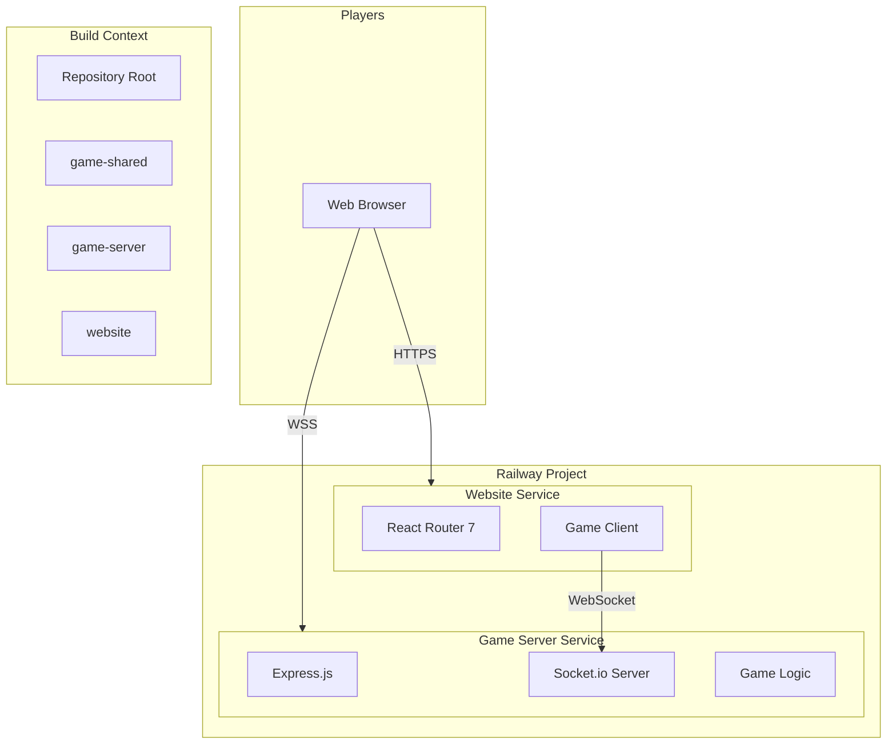
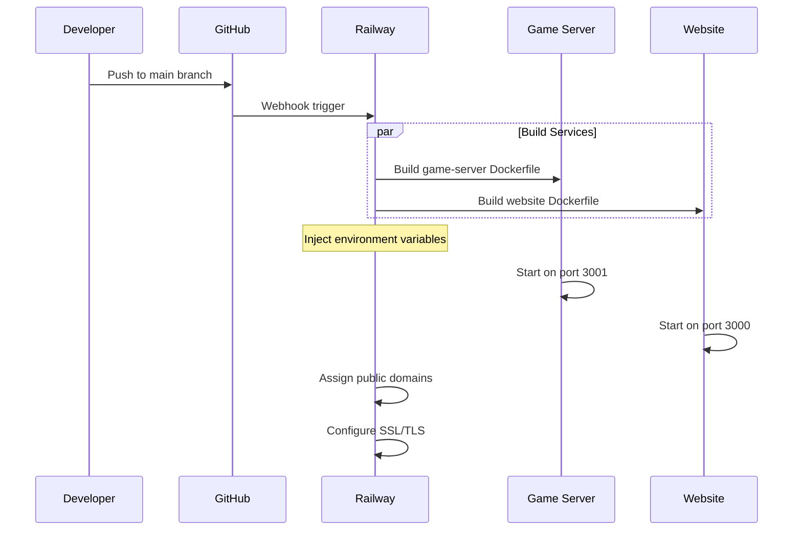
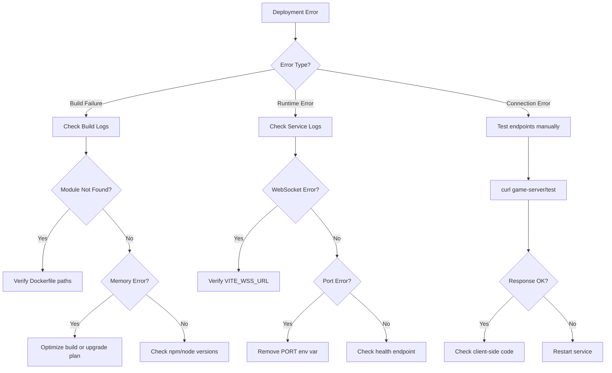

# Railway Deployment Guide - Design Document

## Overview

This guide provides comprehensive instructions for deploying the "Survive the Night" multiplayer game to Railway. The project is a TypeScript monorepo with npm workspaces containing:

- **game-server**: Node.js/Express/Socket.io WebSocket server (port 3001)
- **game-client**: Canvas-based game client (bundled with website)
- **game-shared**: Shared TypeScript types and utilities
- **website**: React Router 7 frontend (port 3000)

Railway deployment requires two services: the game server (WebSocket backend) and the website (frontend). Both services depend on the shared package and must be configured with proper environment variables for inter-service communication.

## Architecture



### Deployment Flow



## Components and Interfaces

### 1. Railway Project Structure

```
Railway Project
├── game-server (Service)
│   ├── Source: GitHub repo
│   ├── Dockerfile: packages/game-server/Dockerfile
│   ├── Build Context: / (root)
│   └── Port: 3001
│
└── website (Service)
    ├── Source: GitHub repo
    ├── Dockerfile: packages/website/Dockerfile
    ├── Build Context: / (root)
    └── Port: 3000
```

### 2. Service Configuration Interface

#### Game Server Service

| Setting | Value |
|---------|-------|
| Root Directory | `/` (repository root) |
| Dockerfile Path | `packages/game-server/Dockerfile` |
| Watch Paths | `packages/game-server/**`, `packages/game-shared/**` |
| Port | 3001 |

#### Website Service

| Setting | Value |
|---------|-------|
| Root Directory | `/` (repository root) |
| Dockerfile Path | `packages/website/Dockerfile` |
| Watch Paths | `packages/website/**`, `packages/game-shared/**`, `packages/game-client/**` |
| Port | 3000 |
| Build Args | `VITE_WSS_URL` |

### 3. Environment Variables Interface

#### Game Server Variables

| Variable | Required | Description | Example |
|----------|----------|-------------|---------|
| `NODE_ENV` | Yes | Environment mode | `production` |
| `ADMIN_PASSWORD` | Yes | Admin command authentication | `your-secure-password` |
| `PORT` | No | Server port (default: 3001) | `3001` |

#### Website Variables

| Variable | Required | Description | Example |
|----------|----------|-------------|---------|
| `NODE_ENV` | Yes | Environment mode | `production` |
| `VITE_WSS_URL` | Yes (build-time) | WebSocket server URL | `wss://game-server-xxx.railway.app` |
| `VITE_API_BASE_URL` | No | REST API base URL | `https://game-server-xxx.railway.app` |
| `PORT` | No | Website port (default: 3000) | `3000` |

## Data Models

### Railway Service Configuration (railway.json)

```json
{
  "$schema": "https://railway.app/railway.schema.json",
  "build": {
    "builder": "DOCKERFILE",
    "dockerfilePath": "packages/game-server/Dockerfile"
  },
  "deploy": {
    "startCommand": null,
    "healthcheckPath": "/test",
    "healthcheckTimeout": 300,
    "restartPolicyType": "ON_FAILURE",
    "restartPolicyMaxRetries": 10
  }
}
```

### Docker Build Context Structure

```
/ (Build Context Root)
├── package.json              # Monorepo root
├── package-lock.json
├── tsconfig.json
└── packages/
    ├── game-shared/
    │   ├── package.json
    │   ├── tsconfig.json
    │   └── src/
    ├── game-server/
    │   ├── package.json
    │   ├── tsconfig.json
    │   ├── Dockerfile
    │   └── src/
    └── website/
        ├── package.json
        ├── tsconfig.json
        ├── Dockerfile
        └── app/
```

## Correctness Properties

*A property is a characteristic or behavior that should hold true across all valid executions of a system-essentially, a formal statement about what the system should do. Properties serve as the bridge between human-readable specifications and machine-verifiable correctness guarantees.*

This deployment guide is primarily documentation-focused. The testable properties relate to the deployed services' behavior:

Property 1: WebSocket Connection Establishment
*For any* valid VITE_WSS_URL configuration, the game client SHALL successfully establish a WebSocket connection to the game server within 10 seconds of page load
**Validates: Requirements 2.2, 3.3**

Property 2: Environment Variable Injection
*For any* build with VITE_WSS_URL set, the compiled website bundle SHALL contain the exact URL value specified at build time
**Validates: Requirements 3.1, 4.2**

Property 3: Service Health Check
*For any* deployed game-server instance, an HTTP GET request to `/test` SHALL return a 200 status code with JSON response
**Validates: Requirements 2.1, 6.6**

Property 4: CORS Configuration
*For any* WebSocket connection attempt from any origin, the game server SHALL accept the connection without CORS errors
**Validates: Requirements 2.3**

## Error Handling

### Common Deployment Errors and Solutions

#### 1. Build Failures

**Error: "Cannot find module '@survive-the-night/game-shared'"**

```
Cause: Build context doesn't include the shared package
Solution: Ensure Dockerfile uses repository root as build context
```

**Error: "npm ERR! Workspaces not supported"**

```
Cause: Old npm version in Docker image
Solution: Use node:20-alpine or later base image
```

**Error: "ENOMEM: not enough memory"**

```
Cause: Build exceeds Railway's memory limits
Solution: 
1. Upgrade Railway plan for more resources
2. Optimize Dockerfile with multi-stage builds
3. Add .dockerignore to exclude unnecessary files
```

#### 2. Runtime Errors

**Error: "WebSocket connection failed"**

```
Cause: Incorrect VITE_WSS_URL or missing WSS support
Solution:
1. Verify VITE_WSS_URL uses wss:// protocol
2. Check game-server domain is correct
3. Ensure game-server is running and healthy
```

**Error: "CORS policy blocked"**

```
Cause: Socket.io CORS configuration mismatch
Solution: Game server already configured with cors: { origin: "*" }
If custom domain, verify SSL certificate is valid
```

**Error: "Connection refused on port 3001"**

```
Cause: Railway internal port mapping issue
Solution:
1. Don't set PORT env var (use defaults)
2. Railway auto-maps internal ports to public domain
```

#### 3. Environment Variable Errors

**Error: "Game client connects to localhost"**

```
Cause: VITE_WSS_URL not set during build
Solution:
1. Set VITE_WSS_URL as build argument in Railway
2. Rebuild website service after setting variable
3. Verify variable appears in build logs
```

**Error: "Admin commands not working"**

```
Cause: ADMIN_PASSWORD not set or incorrect
Solution: Set ADMIN_PASSWORD environment variable in game-server service
```

### Error Recovery Procedures



## Testing Strategy

### Manual Verification Checklist

1. **Game Server Health**
   ```bash
   curl https://your-game-server.railway.app/test
   # Expected: {"message":"Express is working!"}
   ```

2. **WebSocket Connectivity**
   ```javascript
   // Browser console test
   const socket = io('wss://your-game-server.railway.app');
   socket.on('connect', () => console.log('Connected!'));
   socket.on('connect_error', (e) => console.error('Error:', e));
   ```

3. **Website Loading**
   - Navigate to website URL
   - Open browser DevTools Network tab
   - Verify WebSocket connection established
   - Check for console errors

### Deployment Verification Tests

| Test | Expected Result | Validates |
|------|-----------------|-----------|
| GET /test on game-server | 200 OK with JSON | Req 2.1 |
| WebSocket connect to game-server | Connection established | Req 2.2, 3.3 |
| Load website homepage | Page renders without errors | Req 3.2 |
| Start game session | Player spawns in game world | Req 2.3, 3.3 |
| Multiple players connect | All players see each other | Req 2.2 |

---

## Step-by-Step Deployment Instructions

### Prerequisites

1. Railway account (https://railway.app)
2. GitHub repository with the game code
3. Railway CLI (optional): `npm install -g @railway/cli`

### Step 1: Create Railway Project

1. Log in to Railway Dashboard
2. Click "New Project"
3. Select "Deploy from GitHub repo"
4. Authorize Railway to access your repository
5. Select the survive-the-night repository

### Step 2: Deploy Game Server

1. In Railway project, click "New Service"
2. Select "GitHub Repo" → choose your repo
3. Configure service settings:

   **Settings Tab:**
   ```
   Service Name: game-server
   Root Directory: / (leave empty for root)
   ```

   **Build Tab:**
   ```
   Builder: Dockerfile
   Dockerfile Path: packages/game-server/Dockerfile
   ```

   **Variables Tab:**
   ```
   NODE_ENV=production
   ADMIN_PASSWORD=your-secure-password-here
   ```

4. Click "Deploy"
5. Wait for build to complete
6. Note the generated domain (e.g., `game-server-xxx.railway.app`)

### Step 3: Deploy Website

1. Click "New Service" again
2. Select same GitHub repo
3. Configure service settings:

   **Settings Tab:**
   ```
   Service Name: website
   Root Directory: / (leave empty for root)
   ```

   **Build Tab:**
   ```
   Builder: Dockerfile
   Dockerfile Path: packages/website/Dockerfile
   ```

   **Variables Tab (Build Arguments):**
   ```
   VITE_WSS_URL=wss://game-server-xxx.railway.app
   ```
   
   **Variables Tab (Runtime):**
   ```
   NODE_ENV=production
   ```

4. Click "Deploy"
5. Wait for build to complete

### Step 4: Verify Deployment

1. Open game-server domain in browser, append `/test`
   - Should see: `{"message":"Express is working!"}`

2. Open website domain in browser
   - Game should load
   - Enter player name and start game
   - Check browser console for WebSocket connection

### Step 5: Configure Custom Domains (Optional)

1. In Railway, select a service
2. Go to Settings → Domains
3. Click "Add Custom Domain"
4. Add your domain (e.g., `game.yourdomain.com`)
5. Configure DNS:
   ```
   Type: CNAME
   Name: game (or subdomain)
   Value: your-service.railway.app
   ```
6. Wait for SSL certificate provisioning

---

## Troubleshooting Guide

### Issue: Website shows "Connecting..." forever

**Diagnosis:**
1. Open browser DevTools → Console
2. Look for WebSocket errors
3. Check Network tab for failed WS connection

**Solutions:**
1. Verify VITE_WSS_URL is set correctly:
   - Must use `wss://` (not `ws://`)
   - Must match game-server's Railway domain exactly
   - Must be set as build argument, not just runtime variable

2. Rebuild website after changing VITE_WSS_URL:
   - Railway → website service → Deployments → Redeploy

3. Check game-server is running:
   - Railway → game-server → Deployments → View logs

### Issue: "Cannot find module" during build

**Diagnosis:**
Check build logs for the specific missing module.

**Solutions:**

For `@survive-the-night/game-shared`:
```dockerfile
# Ensure Dockerfile copies shared package
COPY packages/game-shared ./packages/game-shared
```

For other modules:
```dockerfile
# Ensure npm ci runs at monorepo root
WORKDIR /app
COPY package.json package-lock.json ./
RUN npm ci
```

### Issue: Build times out

**Diagnosis:**
Railway free tier has 500MB memory limit for builds.

**Solutions:**

1. Add `.dockerignore` at repository root:
   ```
   node_modules
   .git
   *.md
   aseprite
   react-native
   ```

2. Use multi-stage Docker builds (already implemented)

3. Upgrade Railway plan for more resources

### Issue: Game server crashes on startup

**Diagnosis:**
Check Railway logs for error messages.

**Common Causes:**

1. **Missing environment variables:**
   ```
   Error: ADMIN_PASSWORD not set
   Solution: Add ADMIN_PASSWORD to service variables
   ```

2. **Port binding issues:**
   ```
   Error: EADDRINUSE
   Solution: Don't set PORT variable, let Railway handle it
   ```

3. **Memory exceeded:**
   ```
   Error: JavaScript heap out of memory
   Solution: Upgrade Railway plan or optimize game server
   ```

### Issue: Players can't see each other

**Diagnosis:**
This indicates WebSocket broadcast issues.

**Solutions:**

1. Verify both players connect to same game-server instance
2. Check game-server logs for connection events
3. Ensure no firewall/proxy blocking WebSocket frames

### Issue: High latency / lag

**Diagnosis:**
Check player ping in game HUD.

**Solutions:**

1. Choose Railway region closest to players
2. Check game-server CPU/memory usage in Railway metrics
3. Consider upgrading Railway plan for dedicated resources

---

## Railway Configuration Files

### Optional: railway.toml (Repository Root)

```toml
[build]
builder = "dockerfile"

[deploy]
healthcheckPath = "/test"
healthcheckTimeout = 300
restartPolicyType = "on_failure"
restartPolicyMaxRetries = 10
```

### Recommended: .dockerignore

```
# Dependencies
node_modules

# Git
.git
.gitignore

# Documentation
*.md
docs/

# Development files
.cursor
.cursorrules
.editorconfig
.dependency-cruiser.cjs

# Assets not needed for build
aseprite/

# Other platforms
react-native/

# Test files
**/*.test.ts
**/tests/

# IDE
.vscode
.idea
```

---

## Cost Optimization Tips

1. **Use Railway's sleep feature** for development environments
2. **Set up auto-scaling** based on player count
3. **Monitor usage** in Railway dashboard
4. **Use private networking** for service-to-service communication (reduces egress)

## Security Recommendations

1. **Never commit ADMIN_PASSWORD** to repository
2. **Use Railway's secret management** for sensitive values
3. **Enable Railway's DDoS protection** for production
4. **Regularly rotate admin credentials**
5. **Monitor access logs** for suspicious activity
